# Learning Methodology <!-- omit in toc -->

- [Data Pre-Processing](#data-pre-processing)
  - [Object State Estimations](#object-state-estimations)
  - [Myrmex Processing](#myrmex-processing)
- [Network Trainings](#network-trainings)
  - [Training I: cos($\alpha$) as target](#training-i-cosalpha-as-target)
  - [Training II: Polar Coordinates as Targets](#training-ii-polar-coordinates-as-targets)
  - [Training III: 6D Continuous Rotation Representation](#training-iii-6d-continuous-rotation-representation)
  - [Training IV: Gripper Angle](#training-iv-gripper-angle)
  - [Training V: Gripper Transform as Input](#training-v-gripper-transform-as-input)
- [Loss and Input/Output Representation](#loss-and-inputoutput-representation)
  - [On the Continuity of Rotation Representations in Neural Networks (Zhou et.al.)](#on-the-continuity-of-rotation-representations-in-neural-networks-zhou-etal)
  - [6DRepNet](#6drepnet)
  - [PoseCNN](#posecnn)
  - [DeepIM](#deepim)
  - [Takeaways](#takeaways)
- [Next Steps](#next-steps)

## Data Pre-Processing

Before training, we analyze myrmex (input) data and labels. 
The goal is to filter out false label detections and to determine how to equalize myrmex data in terms of sequence length.
First, we visualize all rotation samples to get an idea of how much of the space we've covered during data collection (cuboid set).
From visual inspection, it seems like one quadrant is underrepresented.
It will be interesting to test the network's performance on samples collected in that region.

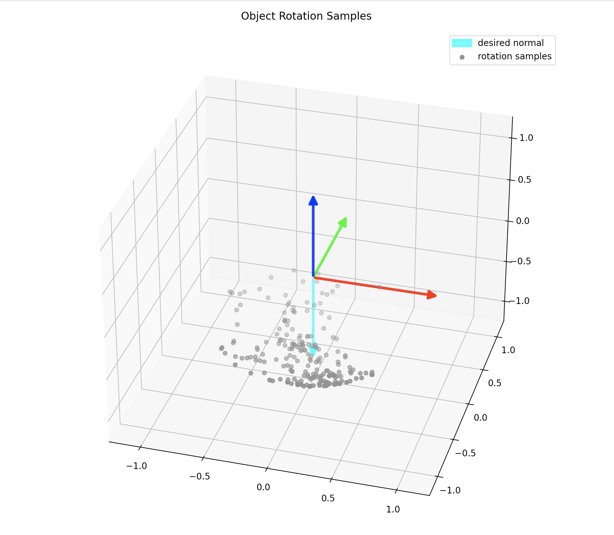

### Object State Estimations

For object state estimates, we only consider data points that were measured before our detected table contact $T$, minus a small time constant $\zeta$ (200ms) to account for delay in the contact detection.
Tag detections can be a bit unreliable at times / be subject to jitter. 
Our setup observes markers over a period of time, thus bad samples are likely to occur. 
Additionally, we potentially have multiple detections per time step (max. one per camera) and we need to decide which one to use or how to reduce them to one label per time step.

The camera $c$ reports a quaternion $q^c(t)$ that describes the rotation of the tables $-Z$ axis to the object's current placing normal.
For each sample we can plot the sequence of $q^c(t)$ for each camera and visually verify whether the data makes sense.
Note, that the number of observations per sample must not be equal among cameras.

Analyzing the data in this way, we find two cases of potentially bad samples: outliers and high-variance sequences.
First, plots of samples that contain outliers:

 | 
-|-

To identify camera sequences with outlier, we can calculate the angle $\alpha^c(t)$ of each estimated object normal to the desired one ($-Z$ in table coordinates).
Then, we calculate the standard deviation of this sequence and if it is higher than a certain threshold, we don't take that camera's measurement into account when producing the final label.

Second, plots of camera sequences with high measurement deviations:

 | 
-|-

Here, the same metric is effective filter out unreliable cameras readings.
Examining the left plot, we can see that one camera sequence has a high standard deviation, and the only other one only two samples.
Both sequences are not reliable, hence we need to filter such samples.

We arrive at the following filter rules to reject camera sequences if, ...

*  ... they have less than $N_{min}$ (10) samples
*  ... their standard deviation is above $\sigma_{min}$ (0.005)

From the cuboid dataset, we reject only 2 out of 203 samples, the one we saw above and one where all cameras only measured 9 object states.

 | 
-|-

**Conversion into Lables**

*Option I: Dot Product*
The dot product between placing normal and object normal is a first, simple label to test network architectures and training setups in general.
However, the value is ambiguous (vectors on a circle with same radius around the placing normal have the same dot product with the placing normal).

*Option II: Polar Coordinates*
Spherical coordinates give us the angle for both rotation required. 
Better use those, since from the angles we can reconstruct the full rotation.

To get polar coordinates (the two angles), we calculate the angle $\theta$ between the table's normal and the placing face's normal in the -Y/Z plane and the angle $\phi$ between the Y-axis and the placing face normal in the X/Z plane.
Rotating by $\theta$ about the X-axis and then by $\phi$ about the Z-axis (stationary base frame axes), we arrive at the object's orientation.

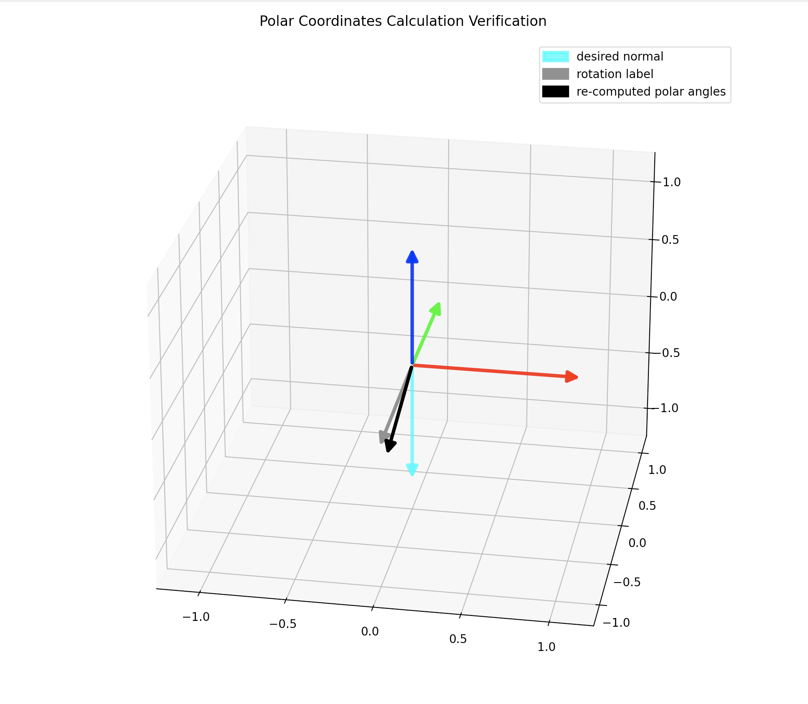

Here, $\mathbf v$ is the label and $\mathbf u$ the result of rotating $-Z$ as described above. 
The vectors don't match exactly, and $v \cdot u = 0.995$.
Not sure if this is sufficient or not.

### Myrmex Processing

The myremx data needs to be of equal sequence length (at least right and left tactile sequences of the same sample).
To do so, we can take a look at the mean sensor activation (i.e. averaged over all cells) per time step and see how many samples of a sequence actually measure an object state change.

 | 
-|-

Here, we just choose a look back window (50 samples) that includes all deviations, including some samples that measure the object without contact.
This can be seen by the vertical blue line in the plots.

A visualization of an example sequence looks like this:

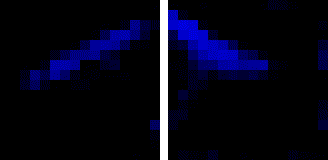

## Network Trainings

### Training I: cos($\alpha$) as target

* 80/20 train-test split on cuboid dataset
* TactileInsertionNet
* 1 episode (= 20 batches)
* MSE Loss
* label were dot product pf $-Z$ and object's placing face normal
* batch size of 8
* also test performance on the cylinder set to test for generalization

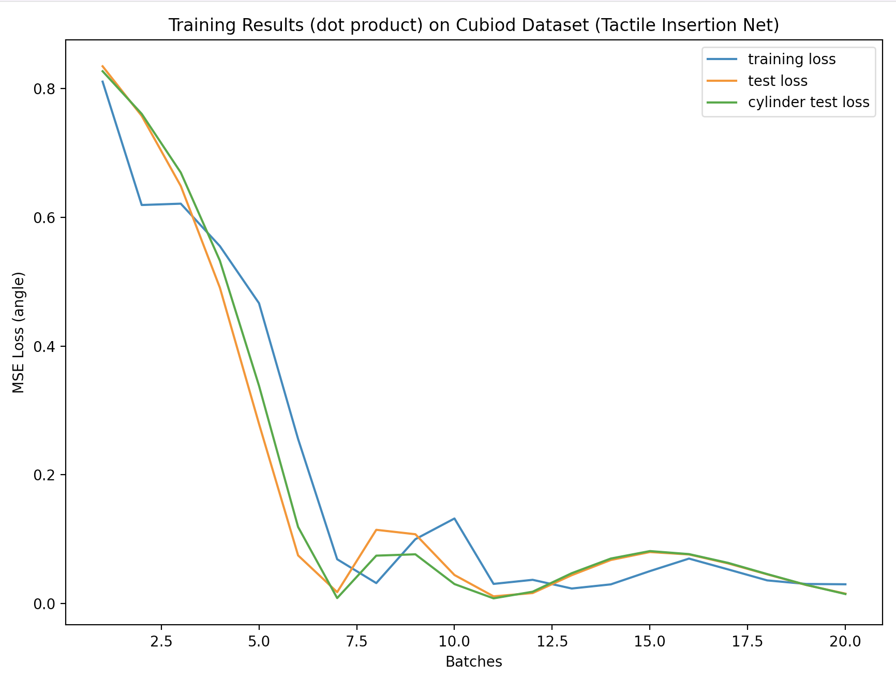

### Training II: Polar Coordinates as Targets

Same setup as in the first experiment, but this time with $cos(\theta)$ and $cos(\phi)$ as targets.
Performance across test and cylinder test set is similar to first training.
The overall loss is higher though.

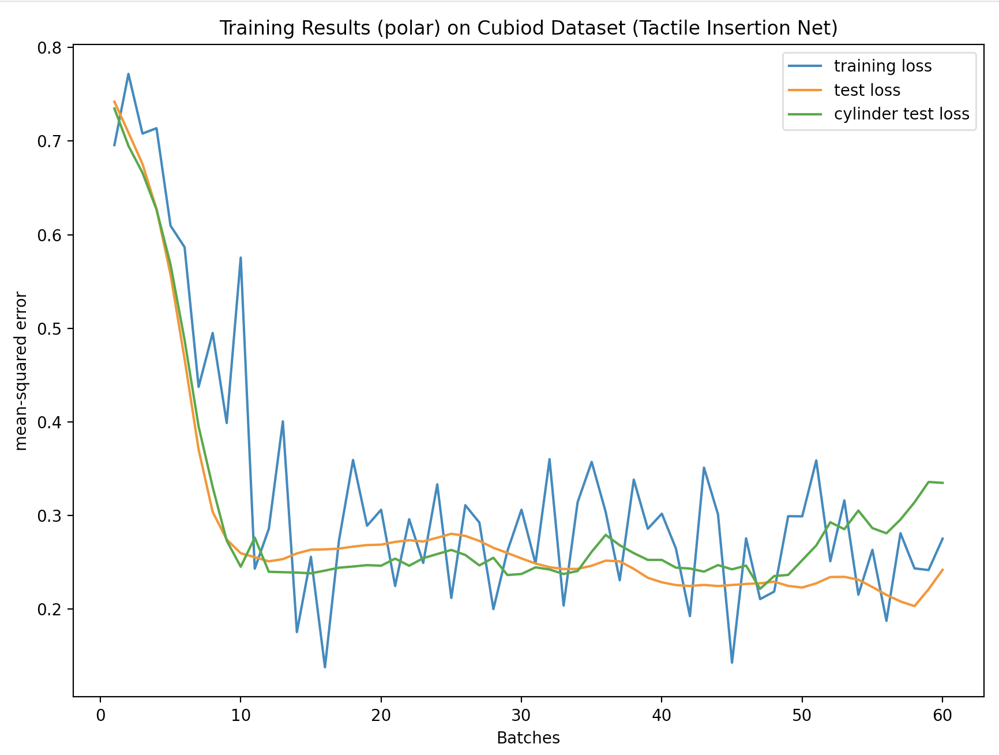

### Training III: 6D Continuous Rotation Representation

* 50 episodes
* targets: gripper -> object and world -> object
* output representation and loss from Zhou et.al. / 6DRepNet
* loss is in [0,PI]

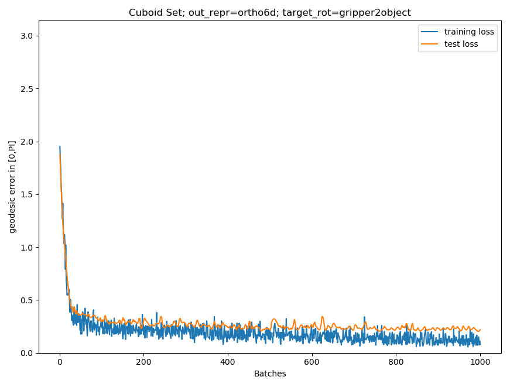 | 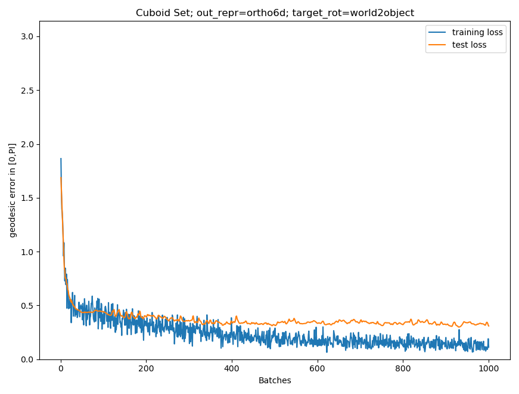
-|-

### Training IV: Gripper Angle 

* angle $\theta$ (from `atan2`) between gripper's Z-axis and object's Z-axis in gripper frame
* outputs are `tanh` -> [sin$\theta$, cos$\theta$]; loss is MSE
* * **bad**, outputs collapse to the same values

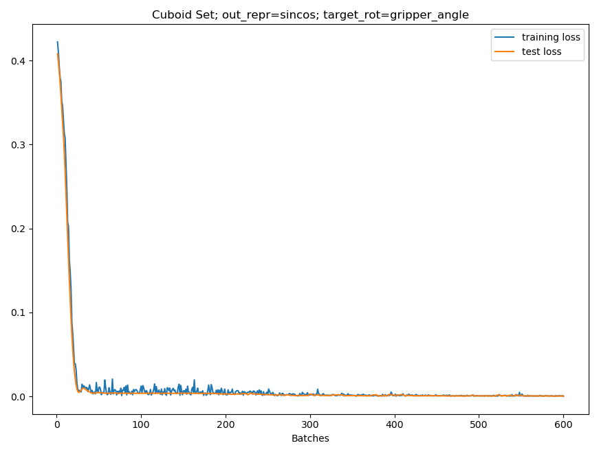

### Training V: Gripper Transform as Input 

* world->gripper rotation as quaternion concatenated to RNN outputs
* outputs and loss from Zhou et.al.

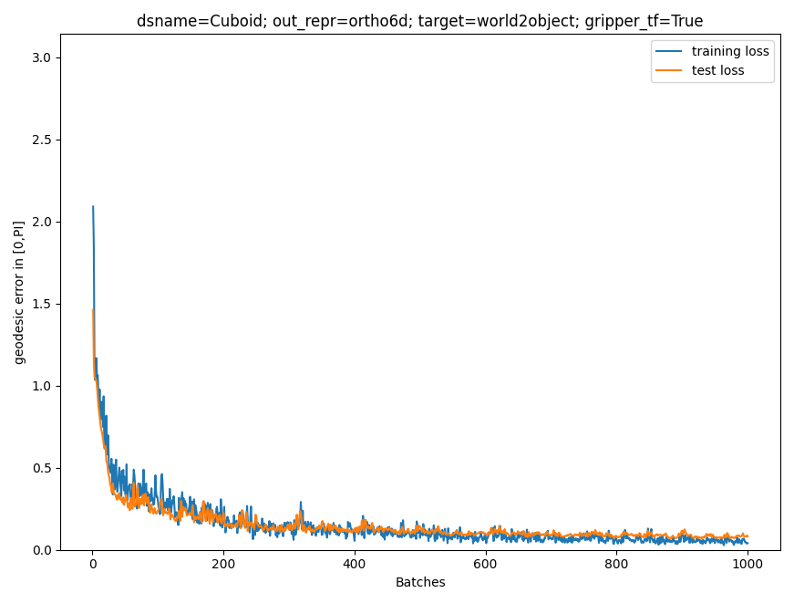

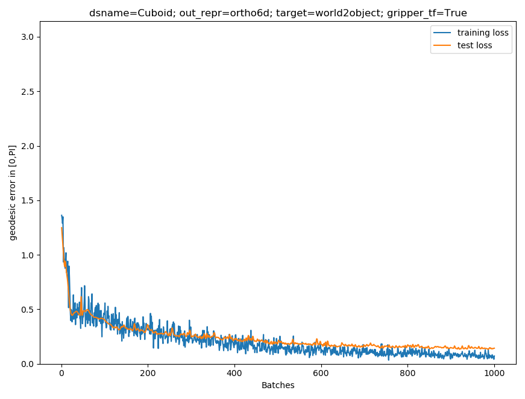 | 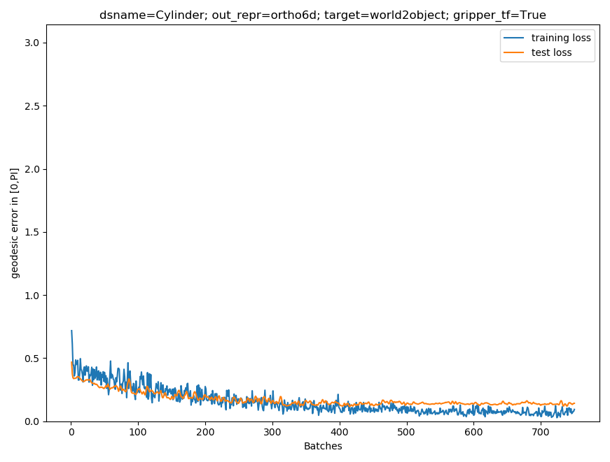
-|-

## Loss and Input/Output Representation

### On the Continuity of Rotation Representations in Neural Networks (Zhou et.al.)

[Paper](https://openaccess.thecvf.com/content_CVPR_2019/papers/Zhou_On_the_Continuity_of_Rotation_Representations_in_Neural_Networks_CVPR_2019_paper.pdf)
[Code](https://github.com/papagina/RotationContinuity/blob/master/sanity_test/code/tools.py)

[Linear output](https://github.com/papagina/RotationContinuity/blob/master/sanity_test/code/model.py#L64) layer for most representations; `tanh` only for euler

[quaternions are normalized though](https://github.com/papagina/RotationContinuity/blob/master/sanity_test/code/tools.py#L111) 

### 6DRepNet

[Paper](https://arxiv.org/pdf/2202.12555.pdf)
[Website](https://pythonawesome.com/official-pytorch-implementation-of-6drepnet-6d-rotation-representation-for-unconstrained-head-pose-estimation/)
[Code](https://github.com/thohemp/6DRepNet)

Activation Fn: [linear](https://github.com/thohemp/6DRepNet/blob/master/model.py#L48)

Loss: [6D Rotation Loss](https://github.com/thohemp/6DRepNet/blob/master/loss.py#L12) from Zhou et.al.

### PoseCNN

[Paper](https://arxiv.org/pdf/1711.00199.pdf)
[Website](https://rse-lab.cs.washington.edu/projects/posecnn/) 
[Code](https://github.com/NVlabs/PoseCNN-PyTorch)

Ouput encoding: quaternion

Activation Fn: [linear](https://github.com/NVlabs/PoseCNN-PyTorch/blob/main/lib/networks/PoseCNN.py#L139), then [normalize](https://github.com/NVlabs/PoseCNN-PyTorch/blob/main/lib/networks/PoseCNN.py#L221)

Pose Loss: $\frac{1}{2 |M|} \sum_{\mathbf x \in M} ||R(\mathbf{\tilde{q}}) \mathbf x - R(\mathbf q) \mathbf x ||^2$ 

### DeepIM

[Paper](https://openaccess.thecvf.com/content_ECCV_2018/papers/Yi_Li_DeepIM_Deep_Iterative_ECCV_2018_paper.pdf)
[Website](https://rse-lab.cs.washington.edu/projects/deepim/)
[Code](https://github.com/liyi14/mx-DeepIM); [Code2](https://github.com/NVlabs/DeepIM-PyTorch)

Output encoding: quaternion
Activation Fn: [linear](https://github.com/NVlabs/DeepIM-PyTorch/blob/master/lib/networks/FlowNetS.py#L140) and [normalize](https://github.com/NVlabs/DeepIM-PyTorch/blob/master/lib/networks/FlowNetS.py#L181)

Point Matching Loss: $\frac{1}{n} \sum_{i = 1}^n L1( (Rx_i + t) - (\hat Rx_i + \hat t) )$

### Takeaways

Two possible loss functions:
1. (-1,4) linear output -> normalize -> `matrix_from_quaternion` -> PoseCNN or DeepIM style matrix loss
2. (-1,6) linear output -> `compute_rotation_matrix_from_ortho6d` -> geodesic loss from Zhou et.al.

Helpful Code:
* [Zhou's Repo](https://github.com/papagina/RotationContinuity/blob/master/sanity_test/code/tools.py)
* [PyTorch3D](https://github.com/facebookresearch/pytorch3d/blob/main/pytorch3d/transforms/so3.py) for conversions etc.

## Next Steps

**Network Evaluation**

* get desired rotation in SO(3) as matrix
  * which loss? 
  * how many output parameters?
  * get gripper orientation
* input data
  * sensor data + gripper orientation R 
  * sensor data only
* output data formats
  * orientation in world frame
  * orientation in gripper frame
* network test on robot (get sample, predict, plot)

**Paper**

* make overleaf template
* start with introduction
* related work section 
  * search for more placing literature
  * add insertion net etc.
* describe experiment setup

**Experiments**

* RL setup 
* more objects? test objects (real life)?