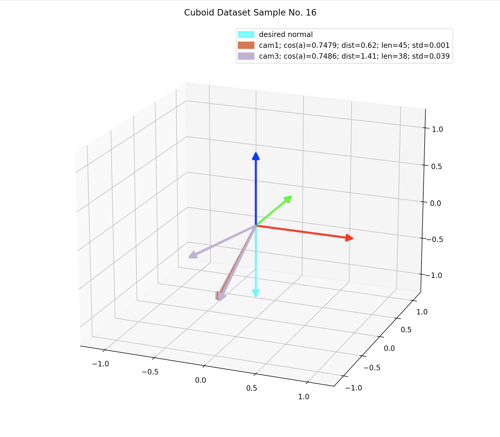
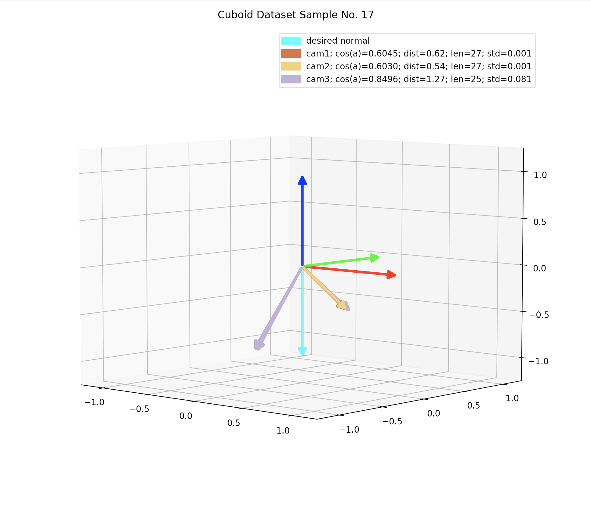
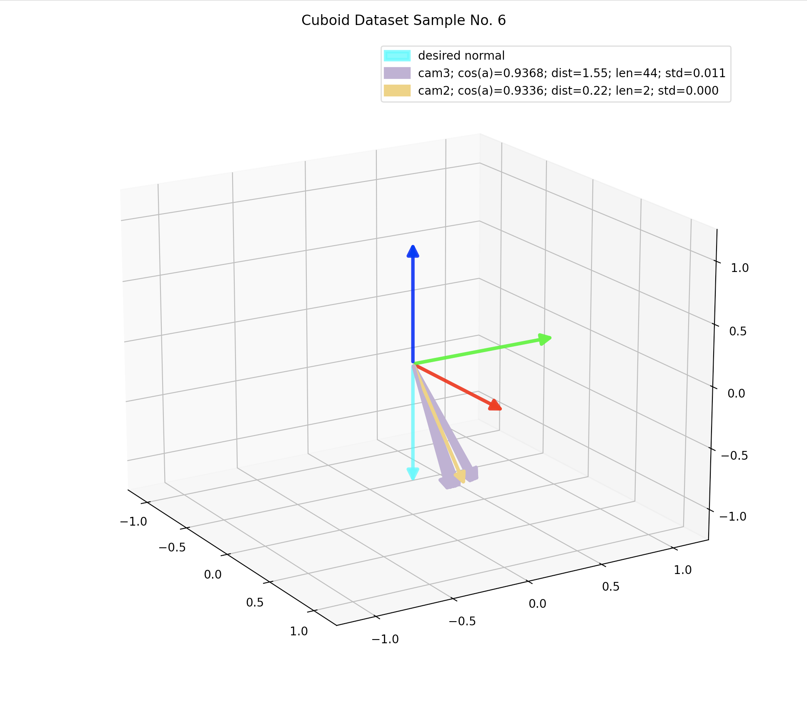
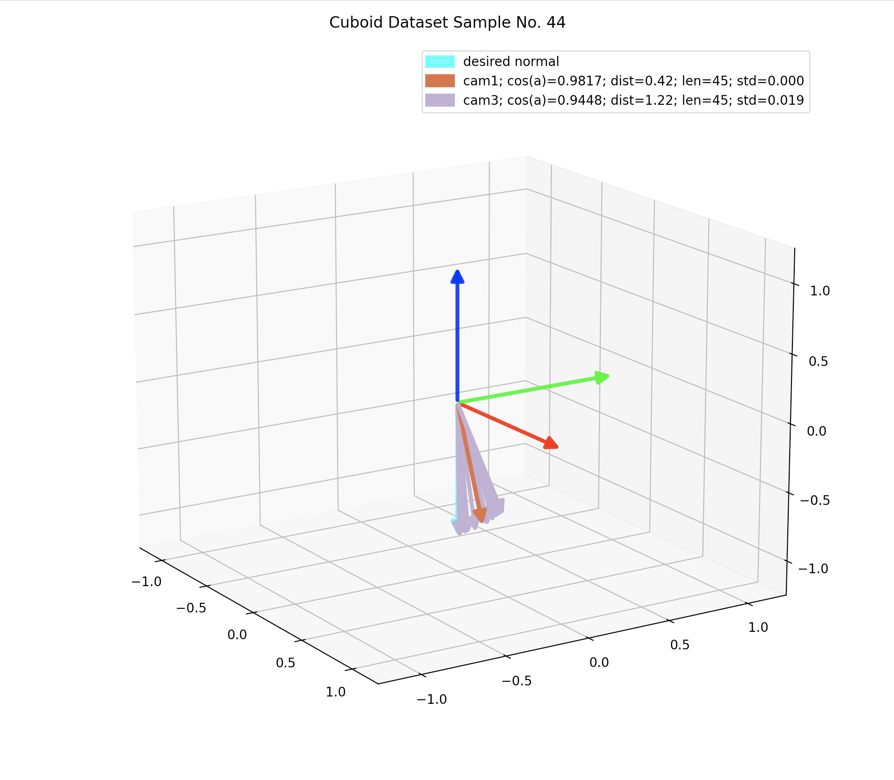
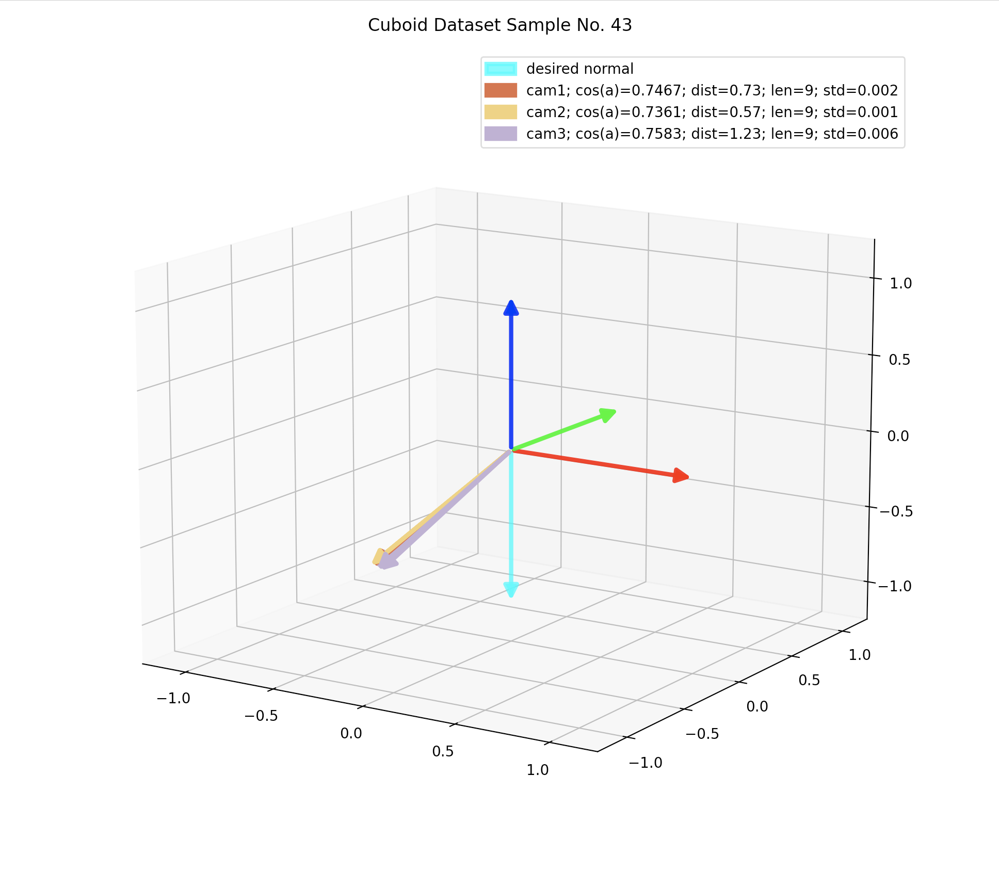
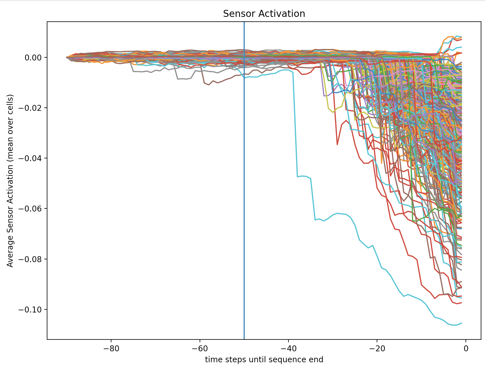
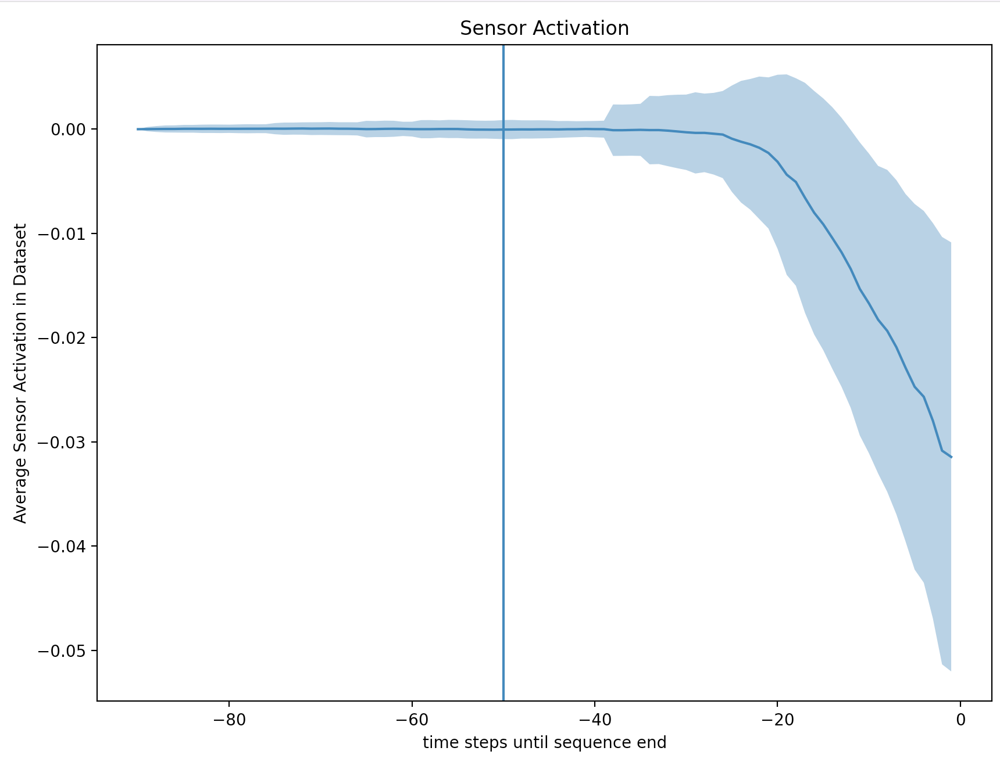

# Learning Methodology

## Data Pre-Processing

Before training, we analyze myrmex (input) data and labels. 
The goal is to filter out false label detections and to determine how to equalize myrmex data in terms of sequence length.

### Object State Estimations

For object state estimates, we only consider data points that were measured before our detected table contact $T$, minus a small time constant $\zeta$ (200ms) to account for delay in the contact detection.
Tag detections can be a bit unreliable at times / be subject to jitter. 
Our setup observes markers over a period of time, thus bad samples are likely to occur. 
Additionally, we potentially have multiple detections per time step (max. one per camera) and we need to decide which one to use or how to reduce them to one label per time step.

The camera $c$ reports a quaternion $q^c(t)$ that describes the rotation of the tables $-Z$ axis to the object's current placing normal.
For each sample we can plot the sequence of $q^c(t)$ for each camera and visually verify whether the data makes sense.
Note, that the number of observations per sample must not be equal among cameras.

Analyzing the data in this way, we find two cases of potentially bad samples: outliers and high-variance sequences.
First, plots of samples that contain outliers:

 | 
-|-

To identify camera sequences with outlier, we can calculate the angle $\alpha^c(t)$ of each estimated object normal to the desired one ($-Z$ in table coordinates).
Then, we calculate the standard deviation of this sequence and if it is higher than a certain threshold, we don't take that camera's measurement into account when producing the final label.

Second, plots of camera sequences with high measurement deviations:

 | 
-|-

Here, the same metric is effective filter out unreliable cameras readings.
Examining the left plot, we can see that one camera sequence has a high standard deviation, and the only other one only two samples.
Both sequences are not reliable, hence we need to filter such samples.

We arrive at the following filter rules to reject camera sequences if, ...

*  ... they have less than $N_min$ (10) samples
*  ... their standard deviation is above $\sigma_{min}$ (0.005)

From the cuboid dataset, we reject only 2 out of 203 samples, the one we saw above and one where all cameras only measured 9 object states.

 | 
-|-

### Myrmex Processing

The myremx data needs to be of equal sequence length (at least right and left tactile sequences of the same sample).
To do so, we can take a look at the mean sensor activation (i.e. averaged over all cells) per time step and see how many samples of a sequence actually measure an object state change.

 | 
-|-

Here, we just choose a looback window (50 samples) that includes all deviations, including some samples that measure the object without contact.
This can be seen by the vertical blue line in the plots.